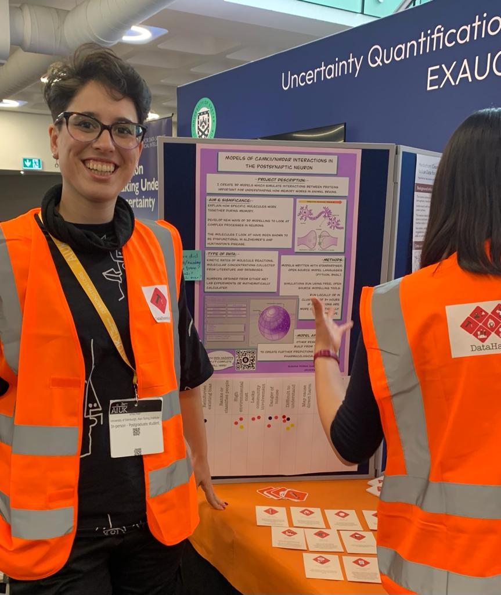

# Data Hazards Project - Case Study
This is a poster I created as a summary of the work I do for my PhD to think about what Data Hazards (DH) apply.

It was presented during AI UK 2022.

The idea behind it would be so that people can have a look at what the project is about and then decide which [Data Hazard labels](https://datahazards.com/contents/data-hazards.html) would apply to it.

So below the poster, there'd be a set up list with the labels and people would put a sticker on the label they thought would apply. I did not think to take a photo of the poster by itself so here is a photo of how it looked with a proud Susana next to it.

